## 0. Take away commands:
### this is a test

- command 1
- command 2
- command 3
---
## 1. Create a new virtual machine:
### this is a test

---

1.1. Go to your "Compute Engine" dashboard in "Google Cloud" and select the desired project.

1.2. Click on "CREATE INSTANCE".

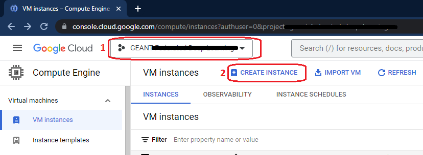

1.3. Define your virtual machine's name that is distinguishable from others.

1.4. Select a "region" for the virtual machine. As a user from Europe, preferably choose a region from Europe to have a faster connection in the future. Here, we have selected "europe-west4 (Netherlands)".

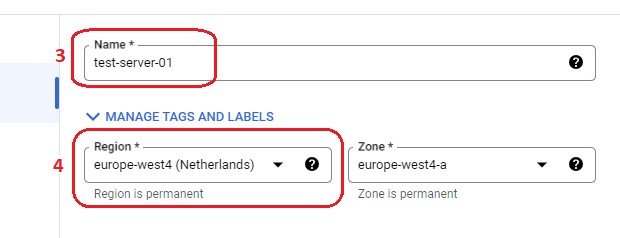

1.5. Under the "Machine configuration" section, click on the "GPUs" tab.

1.6. Select "GPU type". Here we selected the "NVIDIA A100 40GB".

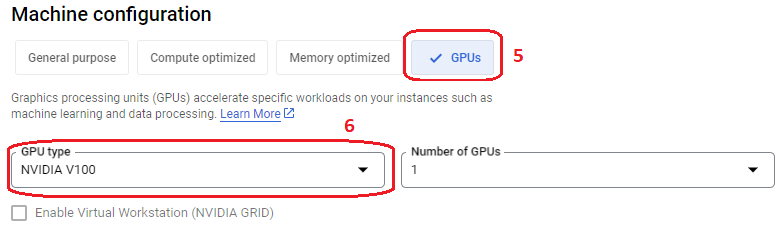

1.7. Under the "Boot disk" section, click on the "CHANGE" button.

1.8. Select the "Operating system". Here we need to select "Deep Learning on Linux".

1.9. Select "Version". Here we need to select "Debian 11 based Deep Learning VM with M109"

1.10. Specify the "Size (GB)". Here we need to specify "100".

1.11. Click on the "Select" button to save and exist.

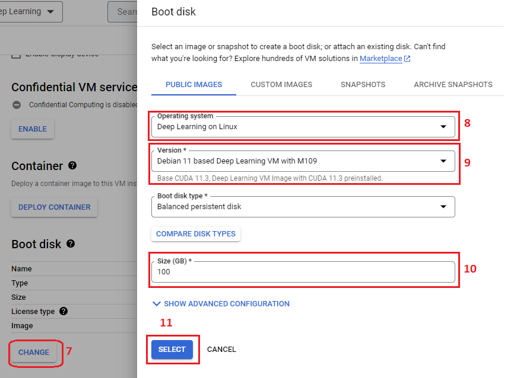

1.12. Click on the "CREATE" button at the end of the page.


1.13. You will see your created virtual machine in the "INSTANCES" tab with a green tick before that.


1.14. If you see a red exclamation mark, it means your virtual machine is not created. You should try it again or change your configuration and create a new one. Here, I tried it again four times and it was created. 


1.15. Remember to click on the "STOP" whenever your computation is done or you no longer work on the virtual machine.

1.16. You can rerun the virtual machine by clicking "START/RESUME". If a virtual machine will not available, you need to try this more than one time sometimes.

1.17. Because of selecting GPUs on your virtual machine, you are not able to "SUSPEND" your machine.

1.18. If you need to reset the virtual machine while you have been working there, just click on the "RESET" button.

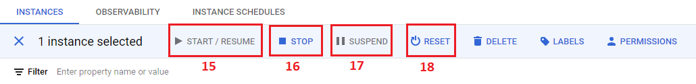

1.19. Great! Now you've created a new virtual machine and you are ready to jump in!


## 2. Install tools and packages on the virtual machine

2.1. Click on "SSH" to connect to the virtual machine.


2.2. If you've chosen the right operating system image, firstly you will see a question where you need to answer "y" to install Cuda, Python, and Anaconda. 

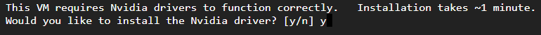

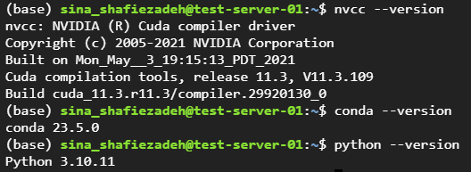

2.3. Create a new environment in conda. You can modify the environment's name (test_env) to whatever you want.

```bash
conda create -n test_env
```

2.4. Activate the new environment.

```bash
conda activate test_env
```

2.5. Install the "jupyter notebook".

```bash
conda install jupyter notebook
```

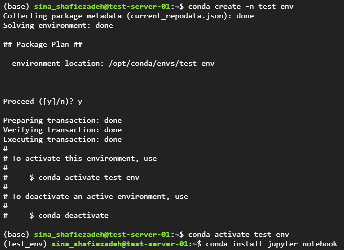

2.3. Install the compatible PyTorch version with the Cuda drive:

```bash
conda install pytorch==1.13.0 pytorch-cuda=11.6 -c pytorch -c nvidia
```

2.4. Install the compatible Torchvision and Torchsummary without changing Pytorch and Cuda versions.

```bash
conda install torchvision==0.14.0
```

```bash
conda install -c conda-forge torchsummary
```
2.5. Install all other packages you need them.

```bash
conda install pandas seaborn matplotlib scikit-learn
```

2.6. Install the "ipykernel"  to add your new environment to your jupyter notebook.

```bash
conda install ipykernel
```

 2.7. Add the new environment ti the jupyter notebook.

 ```bash
python -m ipykernel install --user --name=test_env
```
2.8. Awesome! Now, you've installed all the necessary tools and packages.


## 3. Clone a GitHub repository on the virtual machine

3.1. Create a new repository on GitHub.

[GitHub website](https://github.com/)

3.2. Generate an SSH key pair by running the following command. Replace "your_email@example.com" with the email address associated with your GitHub account. When prompted, you can optionally set a passphrase for your SSH key pair. Setting a passphrase adds an extra layer of security but requires you to enter the passphrase every time you use the SSH key.

```bash
ssh-keygen -t rsa -b 4096 -C "your_email@example.com"
```

3.3. Once the key pair is generated, you should see output similar to:

```bash
Generating public/private rsa key pair.
Your identification has been saved in /home/username/.ssh/id_rsa.
Your public key has been saved in /home/username/.ssh/id_rsa.pub.
```
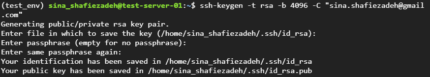

3.4. Use the following command to display the public key:

```bash
cat ~/.ssh/id_rsa.pub
```

3.5. Copy the entire contents of the public key displayed in the terminal.

3.6. Go to your GitHub "setting" click on the "SSH and GPG keys" tab and then click on the "New SSH key" button. 


3.7. Provide a suitable title for the SSH key (e.g., "test-server SSH Key").

3.8. Paste the copied public key into the "Key" field.

3.9. Click on the "Add SSH key" button.

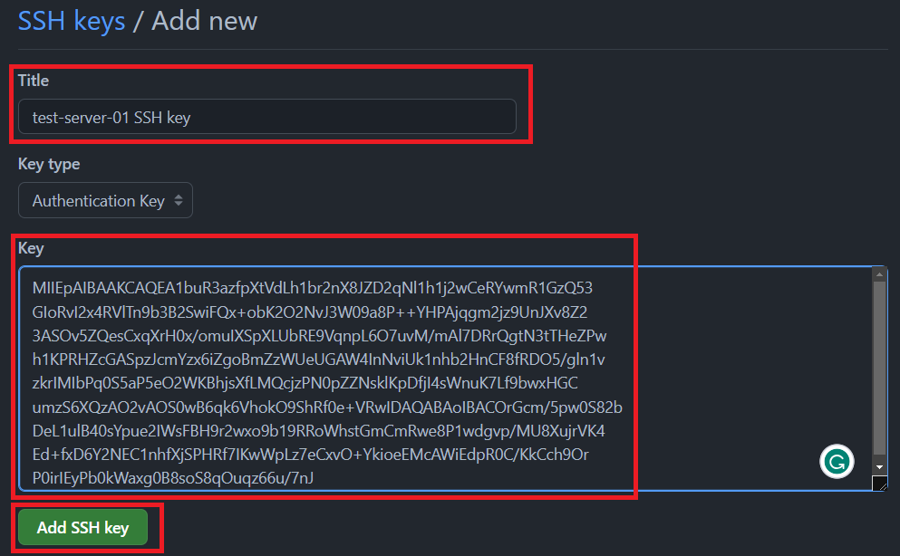

3.10. Copy the repository URL on the GitHub repository page by clicking on the green "Code" button and copying the SSH URL.

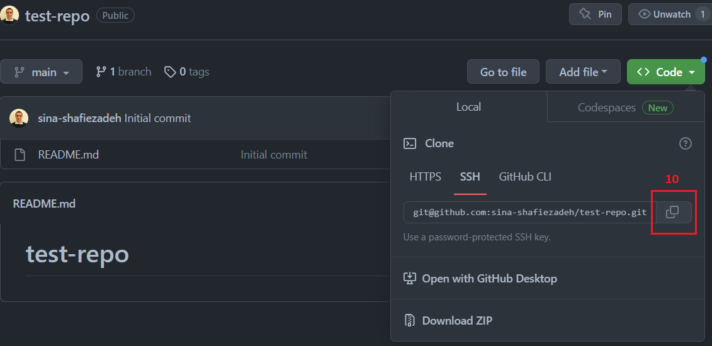

3.11. Clone the repository to the virtual machine. Replacing '<repository-url>' with the URL of your repository

‍‍‍```bash
git clone <repository-url>
```

3.12. Check that the repository is cloned.

‍‍‍```bash
ls
```

3.13. Move inside the repository by changing the directory and checking inside the repository.

‍‍‍```bash
cd test-repo
```

3.14. Move outside the repository by changing the directory.

```bash
cd ..
```

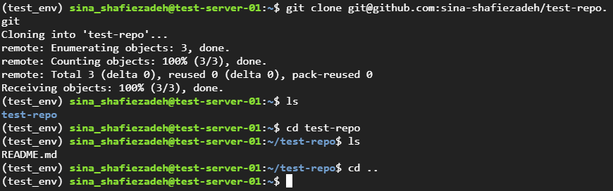

3.15. Perfect! Now, you've created and cloned the new repository on your virtual machine.
