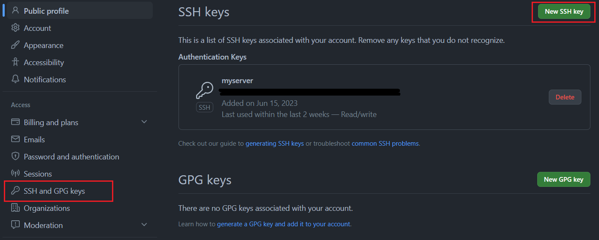
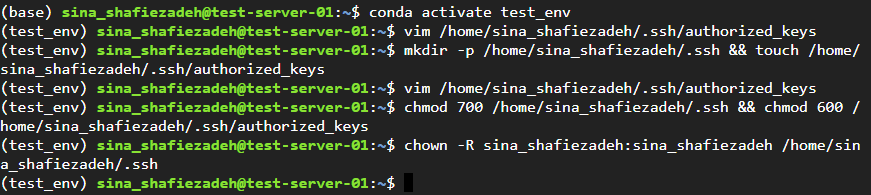

# Table of Contents
- [Section 1: Takeaway commands](#section-1)
- [Section 2: Create a new virtual machine](#section-2)
- [Section 3: Install tools and packages on the virtual machine](#section-3)
- [Section 4: Clone a GitHub repository on the virtual machine](#section-4)
- [Section 5: Run Jupyter Notebook on the virtual machine and open it in a local machine browser](#section-5)
- [Section 6: Control Jupyter Notebooks files version by GitHub](#section-6)
- [Section 7: Upload data and file in the virtual machine](#section-7)
- [Section 8: Troubleshooting](#section-8)


---
## 1. Takeaway commands: <a name="section-1"></a>

- Open a file:
  ```bash
  vim /home/user_name/.ssh/authorized_keys
  ```
  
- Run jupyter notebook :
  ```bash
  jupyter notebook --no-browser --port=8080
  ```
  
- Connect to a virtual machine: 
  ```bash
  ssh -L 8080:localhost:8080 <REMOTE_USER>@<REMOTE_HOST> -N
  ```
  
- GitHub version control:
  ```bash
  git status
  ```
  ```bash
  git add .
  ```
  ```bash
  git commit -m "description"
  ```
  ```bash
  git push origin master
  ```
    
- Upload a file:
  ```bash
  scp /path/to/local/file.zip username@server:/path/on/server/file.zip
  ```

---
## 2. Create a new virtual machine: <a name="section-2"></a>

2.1. Go to your "Compute Engine" dashboard in "Google Cloud" and select the desired project.

2.2. Click on "CREATE INSTANCE".


2.3. Define your virtual machine's name that is distinguishable from others.

2.4. Select a "region" for the virtual machine. As a user from Europe, preferably choose a region from Europe to have a faster connection in the future. Here, we have selected "europe-west4 (Netherlands)".


2.5. Under the "Machine configuration" section, click on the "GPUs" tab.

2.6. Select "GPU type". Here we selected the "NVIDIA V100". We can select a more powerful GPU if we need one, like "NVIDIA A100 40GB".


2.7. Under the "Boot disk" section, click on the "CHANGE" button.

2.8. Select the "Operating system". Here we need to select "Deep Learning on Linux".

2.9. Select "Version". Here we need to select "Debian 11 based Deep Learning VM with M109"

2.10. Specify the "Size (GB)". Here we need to specify "100".

2.11. Click on the "Select" button to save and exist.


2.12. Click on the "CREATE" button at the end of the page.


2.13. You will see your created virtual machine in the "INSTANCES" tab with a green tick before that.


2.14. If you see a red exclamation mark, it means your virtual machine is not created. You should try it again or change your configuration and create a new one. Here, I tried it again four times and it was created. 


2.15. Remember to click on the "STOP" whenever your computation is done or you no longer work on the virtual machine.

2.16. You can rerun the virtual machine by clicking "START/RESUME". If a virtual machine will not available, you need to try this more than one time sometimes.

2.17. Because of selecting GPUs on your virtual machine, you are not able to "SUSPEND" your machine.

2.18. If you need to reset the virtual machine while you have been working there, just click on the "RESET" button.


2.19. Great! Now you've created a new virtual machine and you are ready to jump in!


---
## 3. Install tools and packages on the virtual machine <a name="section-3"></a>

3.1. Click on "SSH" to connect to the virtual machine.


3.2. If you've chosen the right operating system image, firstly you will see a question where you need to answer "y" to install Cuda, Python, and Anaconda. 


3.3. Create a new environment in conda. You can modify the environment's name (test_env) to whatever you want. You can also specify your Python version by adding "python=3.10" following the name of your environment.

```bash
conda create -n test_env
```

3.4. Activate the new environment.

```bash
conda activate test_env
```

3.5. Install the "jupyter notebook".

```bash
conda install jupyter notebook
```


3.3. Install the compatible PyTorch version with the Cuda drive:

```bash
conda install pytorch==1.13.0 pytorch-cuda=11.6 -c pytorch -c nvidia
```

3.4. Install the compatible Torchvision and Torchsummary without changing Pytorch and Cuda versions.

```bash
conda install torchvision==0.14.0
```

```bash
conda install -c conda-forge torchsummary
conda install conda-forge::pytorch-model-summary

```
3.5. Install all other packages you need them.

```bash
conda install pandas numpy seaborn matplotlib scikit-learn
```

3.6. Install the "ipykernel"  to add your new environment to your jupyter notebook.

```bash
conda install ipykernel
```

3.7. Add the new environment ti the jupyter notebook.

 ```bash
python -m ipykernel install --user --name=test_env
```
3.8. Awesome! Now, you've installed all the necessary tools and packages.


---
## 4. Clone a GitHub repository on the virtual machine: <a name="section-4"></a>

4.1. Create a new repository on GitHub.

[GitHub website](https://github.com/)

4.2. Generate an SSH key pair by running the following command. Replace 'your_email@example.com' with the email address associated with your GitHub account. When prompted, you can optionally set a passphrase for your SSH key pair. Setting a passphrase adds an extra layer of security but requires you to enter the passphrase every time you use the SSH key.

```bash
ssh-keygen -t rsa -b 4096 -C "your_email@example.com"
```

4.3. Once the key pair is generated, you should see output similar to:

```bash
Generating public/private rsa key pair.
Your identification has been saved in /home/username/.ssh/id_rsa.
Your public key has been saved in /home/username/.ssh/id_rsa.pub.
```


4.4. Use the following command to display the public key:

```bash
cat ~/.ssh/id_rsa.pub
```

4.5. Copy the entire contents of the public key displayed in the terminal.

4.6. Go to your GitHub "setting" click on the "SSH and GPG keys" tab and then click on the "New SSH key" button. 



4.7. Provide a suitable title for the SSH key (e.g., "test-server SSH Key").

4.8. Paste the copied public key into the "Key" field.

4.9. Click on the "Add SSH key" button.


4.10. Copy the repository URL on the GitHub repository page by clicking on the green "Code" button and copying the SSH URL.


4.11. Clone the repository to the virtual machine. Replacing '<repository-url>' with the URL of your repository

``` bash
git clone <repository-url>
```

4.12. Check that the repository is cloned.

```bash
ls
```

4.13. Move inside the repository by changing the directory and checking inside the repository.

```bash
cd test-repo
```

4.14. Move outside the repository by changing the directory.

```bash
cd ..
```


4.15. Perfect! Now, you've created and cloned the new repository on your virtual machine.


---
## 5. Run Jupyter Notebook on the virtual machine and open it in a local machine browser: <a name="section-5"></a>

5.1. Open a terminal or command prompt on your local machine and create and copy your public SSH key just like in step 3.2. to 3.5.

5.2. Create an SSH directory in the virtual machine. Change the 'user name' to your own user name. You can find your 'user name' before your virtual machine's name.


```bash
mkdir -p /home//.ssh && touch /home/user_name/.ssh/authorized_keys
```

5.3. Open the 'authorized_keys' file with a text editor like Vim. Change the 'user name' to your own user name.

```bash
vim /home/user_name/.ssh/authorized_keys
```


5.4. Past your local machine's public SSH key there. Then save and close the file (press 'esc' then write ':wq').


5.5. Set appropriate authorization to the file. First, set the correct file permissions and second, change the ownership to the 'user name'

```bash
chmod 700 /home/user_name/.ssh && chmod 600 /home/user_name/.ssh/authorized_keys
```

```bash
chown -R username:username /home/username/.ssh
```




5.6. Run Jupyter Notebook with a desired port number (here is 8081) on the virtual machine without opening a browser. Then, copy one of the generated URLs and paste it on a browser on your local machine.

```bash
jupyter notebook --no-browser --port=8081
```


5.7. Open a terminal or command prompt on your local machine. Connect to the virtual machine. Replace '<REMOTE_USER>' with your 'user name' and '<REMOTE_HOST>' with your 'External IP' that you can find on the Compute Engine dashboard.


```bash
ssh -L 8080:localhost:8080 <REMOTE_USER>@<REMOTE_HOST> -N
```


5.8. Amazing! Now, you can work with your virtual machine Jupyter Notebook on your local machine. You can see the cloned repository (test_repo) and you can also have access to your new environment (test_env) as well.


---
## 6. Control Jupyter Notebooks files version by GitHub: <a name="section-6"></a>

6.1. Move inside the repository folder and create a new change. Here, I've created a new file named 'hello_world'


6.2. Open a new shell on the virtual machine, just like in step 2.1.

6.3. Change the directory into the repository.

6.4. Set your Git user email and name. Replace "you@example.com" with your email address and "Your Name" with your preferred name or username.

```bash
git config --global user.email "you@example.com"
git config --global user.name "Your Name"
```

6.5. Get status and see changes.

```bash
git status
```

6.6. Add desired changes. Replace notebook.ipynb with the actual filename of your Jupyter Notebook file.

```bash
git add notebook.ipynb
```

6.7. Commit the changes. Replace the commit message within the quotes with a descriptive message for the changes you made.

```bash
git commit -m "Update Jupyter Notebook file"
```

6.8. Push the changes. This command pushes the commits from your local master branch to the master branch of the remote repository named origin. If you are working on a different branch, replace the master with the appropriate branch name.

```bash
git push origin master
```


6.9. Fantastic! Now, you have the updated repository on your GitHub.


---
## 7. Upload data and file in the virtual machine: <a name="section-7"></a>

7.1. In method one, likely for a small size file, click on "UPLOAD FILE" after opening the window by following to click on "SSH" in front of the virtual machine name.


7.2. In method two, useful for any size file, open a terminal or command prompt on your local machine and use the 'scp' command. Replace '/path/to/local/file.zip' with the local file's path and 'username@server:/path/on/server/file.zip' with the server's login details and the destination path where you want to upload the ZIP file. Finally, you can unzip the zip file in the directory.

```bash
scp /path/to/local/file.zip username@server:/path/on/server/file.zip
```
```bash
unzip file.zip
```

7.3. You can also provide additional options to the unzip command to modify its behavior. For example, you can use the '-d' option followed by a directory name to specify a different destination directory for the extracted files.

```bash
unzip file.zip -d /path/to/destination/directory
```

7.4. Excellent! Now, you can upload files as much as you want. Of course, with care to your virtual machine capacity. 


---
## 8. Troubleshooting: <a name="section-8"></a>

8.1. Apparently, there are integration issues when installing different packages using both 'pip' and 'conda'. To ensure smooth compatibility, it is advisable to install all the necessary Python packages using the 'conda' command.

8.2. When installing 'Torchvision', it is important to specify the version during the installation process. Failure to do so may result in an incompatible version of PyTorch being installed, causing issues with the CUDA version.

8.3. If you find yourself frequently needing to shut down virtual machines, resulting in a change of the server's IP address each time, it can be convenient to automate the process of saving your local machine's SSH key into the 'authorized_keys' file using a 'bash' script.

8.4. To ensure that Jupyter Notebook continues running on a virtual machine even when you close the window, you can create a new screen using the 'screen -R' command and then execute your tasks within that screen. Later, you can detach the screen by running 'screen -d'.

8.5. If there are any other aspects you believe could be improved or any additional information you would like to include in these instructions, please let me know. Your feedback is greatly appreciated.


